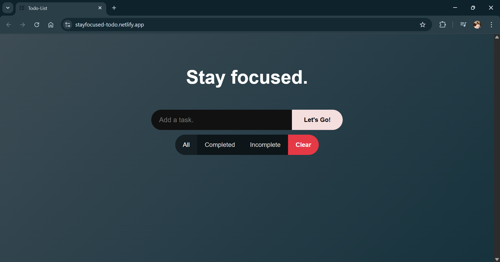
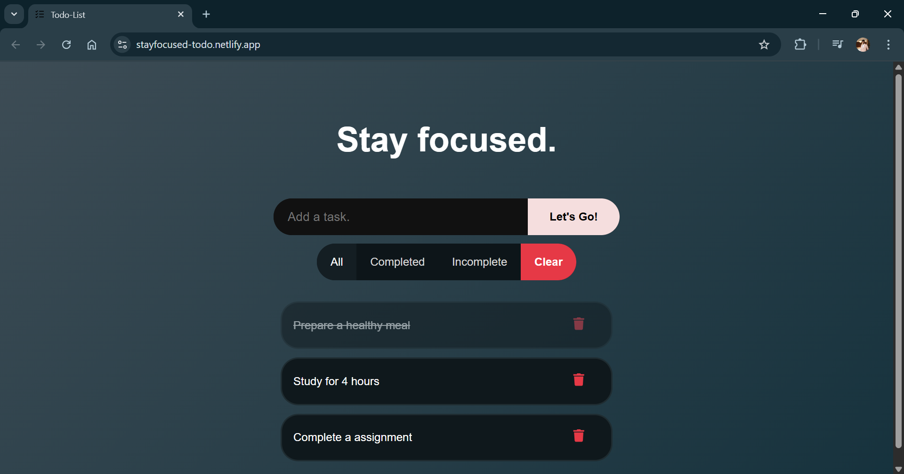
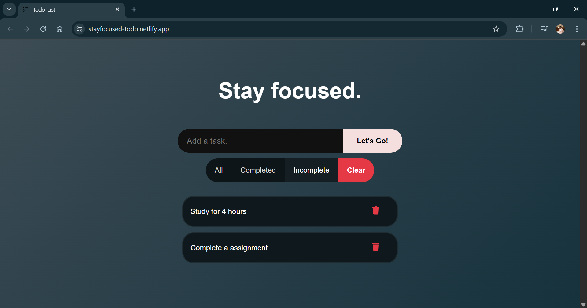

# Todo List

A simple todo app built with React and Vite.  
You can add tasks, edit them, delete them, mark them as complete, and filter them.  
All tasks are saved in localStorage so they stay even after a refresh.

## Live Demo
https://stayfocused-todo.netlify.app/

## Screenshots

## Features
- Add, edit and delete tasks  
- Mark tasks as complete  
- Filter by All / Completed / Incomplete  
- Saves data in localStorage  

## Tech Stack
- React  
- Vite  
- JavaScript  
- CSS  

## About
This project helped me practice React and improve how I build and structure frontend apps.
